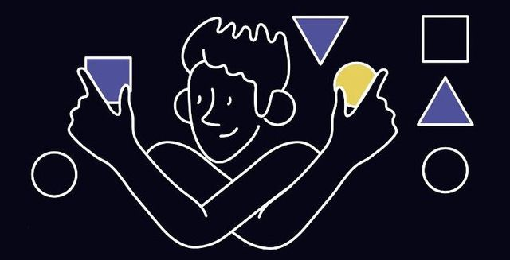

# Тренировки по алгоритмам от Яндекса

Академия Яндекса проводит образовательные онлайн-занятия по алгоритмам. Здесь собраны лекции, задачи и их разбор за разные годы.

Преподаватель: Михаил Густокашин.

На лекциях и в разборах преподаватель пишет на Python. Сами задачи нужно решать на платформе Яндекс.Контест.

1. Тренировки по алгоритмам 1.0 (2021 год)

   - Лекции
   - Задачи и их разбор

2. Тренировки по алгоритмам 2.0 (2021 год)

   - Задачи (2 уровня сложности) и их разбор

3. Интенсив по алгоритмам (2022 год)
   - Задачи и их разбор

## Лекции

- [x] Лекция 1: «Сложность, тестирование, особые случаи»: [Youtube](https://www.youtube.com/watch?v=QLhqYNsPIVo&list=PL6Wui14DvQPySdPv5NUqV3i8sDbHkCKC5)

- [x] Лекция 2: «Линейный поиск»: [Youtube](https://www.youtube.com/watch?v=SKwB41FrGgU&list=PL6Wui14DvQPySdPv5NUqV3i8sDbHkCKC5&index=2)

- [x] Лекция 3: «Множества»: [Youtube](https://www.youtube.com/watch?v=PUpmV2ieIHA&list=PL6Wui14DvQPySdPv5NUqV3i8sDbHkCKC5&index=3)

- [x] Лекция 4: «Словари и сортировка подсчётом»: [Youtube](https://www.youtube.com/watch?v=Nb5mW1yWVSs&list=PL6Wui14DvQPySdPv5NUqV3i8sDbHkCKC5&index=4)

- [x] Лекция 5: «Префиксные суммы и два указателя»: [Youtube](https://www.youtube.com/watch?v=de28y8Dcvkg&list=PL6Wui14DvQPySdPv5NUqV3i8sDbHkCKC5&index=6)

- [x] Лекция 6: «Бинарный поиск»: [Youtube](https://www.youtube.com/watch?v=YENpZexHfuk&list=PL6Wui14DvQPySdPv5NUqV3i8sDbHkCKC5&index=7)

- [x] Лекция 7: «Сортировка событий»: [Youtube](https://www.youtube.com/watch?v=hGixDBO-p6Q&list=PL6Wui14DvQPySdPv5NUqV3i8sDbHkCKC5&index=9)

- [x] Лекция 8: «Деревья»: [Youtube](https://www.youtube.com/watch?v=lEJzqHgyels&list=PL6Wui14DvQPySdPv5NUqV3i8sDbHkCKC5&index=10)

## Интенсив по алгоритмам (2022 год)

- [x] Интенсив по задачкам. Вводный семинар: [Youtube](https://youtu.be/KXZhSizvig4)

- [x] Домашнее задание 1 (лекции 1 и 2): [Яндекс.Контест](https://contest.yandex.ru/contest/39359)

  - [x] Разбор домашнего задания 1: [Youtube](https://youtu.be/aJs9TQOadfA)

- [x] Домашнее задание 2 (лекции 3 и 4): [Яндекс.Контест](https://contest.yandex.ru/contest/39714)

  - [x] Разбор домашнего задания 2: [Youtube](https://www.youtube.com/watch?v=BjIrSQAMzr0)

- [x] Домашнее задание 3 (лекции 5 и 6): [Яндекс.Контест](https://contest.yandex.ru/contest/40146)

  - [x] Разбор домашнего задания 3: [Youtube](https://youtu.be/J9LUtUbMRpk)

- [x] Домашнее задание 4 (лекции 7 и 8): [Яндекс.Контест](https://contest.yandex.ru/contest/40183)

  - [x] Разбор домашнего задания 4: [Youtube](https://youtu.be/coZrFBPnFco)

## Тренировки по алгоритмам 2.0 (дивизион B)

Базовый уровень сложности. Ориентированный на задачи на собеседованиях.

- [x] Домашнее задание 1: [Яндекс.Контест](https://contest.yandex.ru/contest/28730/enter/)
- [x] Домашнее задание 2: [Яндекс.Контест](https://contest.yandex.ru/contest/28738/enter/)

  - [x] Разбор заданий 1 и 2: [Youtube](https://www.youtube.com/watch?v=WZgl1GW3lMA)

- [x] Домашнее задание 3: [Яндекс.Контест](https://contest.yandex.ru/contest/28964)

- [x] Домашнее задание 4: [Яндекс.Контест](https://contest.yandex.ru/contest/28970)

  - [x] Разбор заданий 3 и 4: [Youtube](https://youtu.be/adZYAsm6kow)

- [x] Домашнее задание 5: [Яндекс.Контест](https://contest.yandex.ru/contest/29075)

- [x] Домашнее задание 6: [Яндекс.Контест](https://contest.yandex.ru/contest/29188)

  - [x] Разбор заданий 5 и 6: [Youtube](https://youtu.be/0ExkSKz0Y8U)

- [x] Домашнее задание 7: [Яндекс.Контест](https://contest.yandex.ru/contest/29396)

- [x] Домашнее задание 8: [Яндекс.Контест](https://contest.yandex.ru/contest/29403)

  - [x] Разбор заданий 7 и 8: [Youtube](https://youtu.be/r5mRCMLY_L4)

## Тренировки по алгоритмам 2.0 (дивизион A)

Повышенный уровень сложности. Ориентированный на олимпиады и спортивное программирование.

- [ ] Домашнее задание 1 - [Яндекс.Контест](https://contest.yandex.ru/contest/28724/enter/)
- [ ] Домашнее задание 2 - [Яндекс.Контест](https://contest.yandex.ru/contest/28736/enter/)
- [ ] Разбор заданий 1 и 2 - [Youtube](https://www.youtube.com/watch?v=SP_zryTfMIc)
- ...

## Тренировки по алгоритмам 1.0

...

## Дополнительные ссылки к тренировкам

- Домашняя страница тренировок: [yandex.ru/yaintern/algorithm-training](https://yandex.ru/yaintern/algorithm-training)

- Официальный чат в Телеграме для общения и вопросов о тренировках: [t.me/joinchat/Ve7wRegrZtI0NjIy](https://t.me/joinchat/Ve7wRegrZtI0NjIy)

- Репозитории участников с решением (хэштег `yandex-algorithm-trainings`): https://github.com/topics/yandex-algorithm-trainings

  - Пример репозитория с решениями на JavaScript: https://github.com/zlobnikov/Yandex.Algorithms

- Ссылка с образцами ввода-вывода для всех языков: https://yandex.ru/support/contest/examples-stdin-stdout.html

- Телеграм-бот: `@gettestfromcontestbot`
  Актуален только для тренировок 1.0 и 2.0. Позволяет получить входные/выходные данные тестов Яндекс.Контеста для анализа ошибок в решении.

## Дополнительные ссылки к задачам по алгоритмам

- [x] Как проходят алгоритмические секции на собеседованиях в Яндекс
  - [x] Контест с пробными задачами с собеседований: [Яндекс.Контест](https://contest.yandex.ru/contest/8458)
  - [x] Статья с описанием собедеседований и рабором задач: [Хабр](https://habr.com/ru/company/yandex/blog/449890/)
- [ ] Курс Яндекс.Практикума "Подготовка к алгоритмическим собеседованиям"
  - [ ] Задачи для самостоятельного решения: [Яндекс.Контест](https://contest.yandex.ru/contest/36783)
  - [ ] Подготовленные шаблоны кода для решения задач (написаны получение/вывод данных, осталось написать только само решение) [Github](https://github.com/Yandex-Practicum/algo-interviews-templates)
